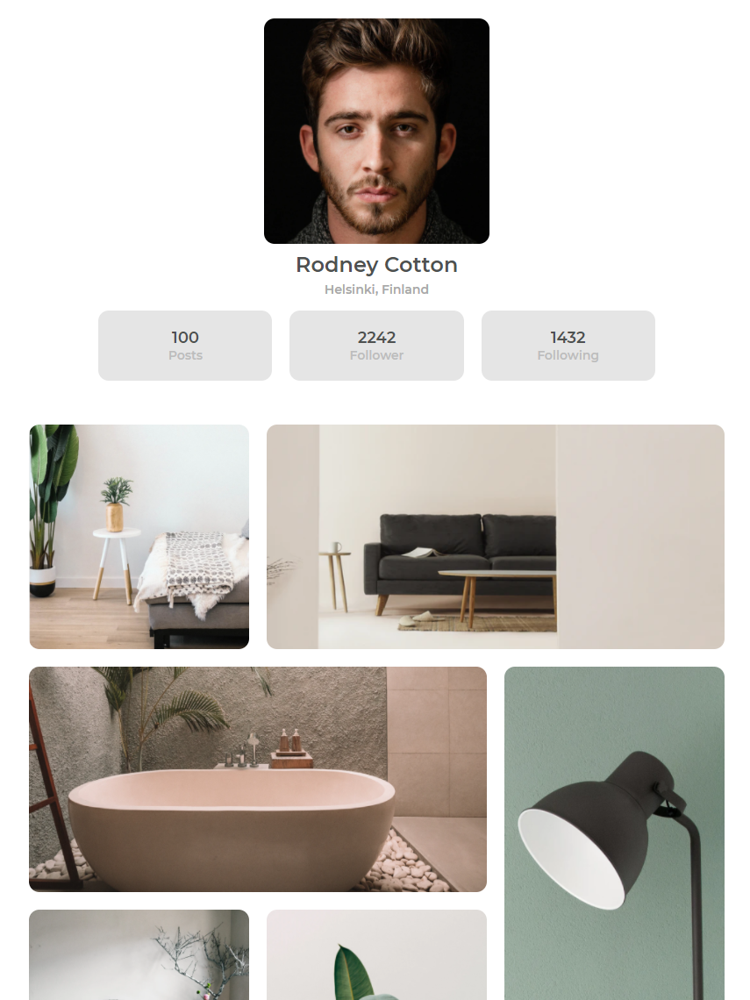

<!-- Please update value in the {}  -->

<h1 align="center">My Gallery</h1>

   Solution for a challenge from  <a href="http://devchallenges.io" target="_blank">Devchallenges.io</a>.

  <h3>
    <a href="https://naughty-brahmagupta-b8f2a8.netlify.app/">
      Demo
    </a>
     | 
    <a href="https://github.com/LiXin2014/MyGallery_DevChallange">
      Solution
    </a>
     | 
    <a href="https://devchallenges.io/challenges/gcbWLxG6wdennelX7b8I">
      Challenge
    </a>
  </h3>

<!-- TABLE OF CONTENTS -->

## Table of Contents

- [Overview](#overview)
- [Features](#features)
- [Contact](#contact)

<!-- OVERVIEW -->

## Overview

Built a responsive interior consultant page with HTML, CSS, and JavaScript.

Example screenshot:

## Features

<!-- List the features of your application or follow the template. Don't share the figma file here :) -->

This application/site was created as a submission to a [DevChallenges](https://devchallenges.io/challenges) challenge. The [challenge](https://devchallenges.io/challenges/gcbWLxG6wdennelX7b8I) was to build an application to complete the given user stories.

## Contact

- GitHub [@LiXin2014](https://github.com/LiXin2014)